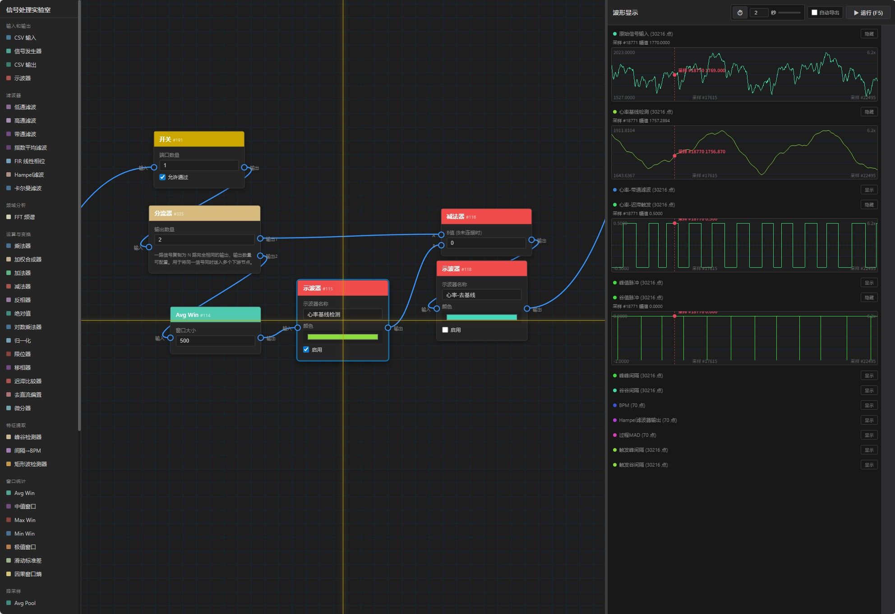

# 信号处理实验室

一个基于浏览器的可视化信号处理工具，通过拖拽节点和连线构建信号处理流程图。

## 功能特性

### 节点类型

| 分类 | 节点 | 说明 |
|------|------|------|
| **输入和输出** | CSV 输入 | 导入 CSV 文件作为信号源，可设置采样率和备注名 |
| | 信号发生器 | 生成默认正弦波；可设置频率、高/低电平和输出长度，接入长度参考时跟随参考序列长度 |
| | CSV 输出 | 手动导出输入信号为纯净 CSV；正文无表头且每行一个采样点，文件名包含名称、时间戳和采样率 |
| | 示波器 | 输出波形到右侧图表（可设颜色）；关闭「启用」后不出现在右侧波形显示中 |
| **滤波器** | 低通滤波 | RC 低通滤波器，可调阶数 (1~8)，阶数越高衰减越陡（每阶 6dB/oct） |
| | 高通滤波 | RC 高通滤波器，可调阶数 (1~8) |
| | 带通滤波 | 低通 + 高通级联，可调阶数；⚠ 两截止频率应相差 2~3 倍以上 |
| | 指数平均滤波 | EMA / 一阶 IIR，`y[i]=α·x[i]+(1-α)·y[i-1]`，可调平滑系数 α |
| | FIR 线性相位 | Hamming 窗 sinc 低通 FIR；可设置截止频率和奇数抽头数量 |
| | Hampel滤波 | Hampel/MAD 异常点滤波；输出滤波结果和局部 MAD，便于调阈值 |
| | 卡尔曼滤波 | 递归估计器，参数 Q(过程噪声) R(测量噪声) |
| **频域分析** | FFT 频谱 | 输出单边幅值谱；可设置最小/最大显示频率，留空时默认显示 0 到采样率/2；示波器会按频率 Hz 显示 X 轴 |
| **运算与变换** | 乘法器 | A × B（双输入，B未连接时用设定值） |
| | 加权合成器 | 多路输入按每路权重逐点相乘后求和，输入数量和权重可配置 |
| | 加法器 | A + B（双输入，B未连接时用设定值） |
| | 减法器 | A - B（双输入，B未连接时用设定值） |
| | 反相器 | 信号 × -1 |
| | 绝对值 | out = \|x\| |
| | 对数乘法器 | out = x·log(1+\|x\|)/log(1+max)，大值乘大系数 |
| | 归一化 | 映射到 [-1, 1]；支持按全部输入缓冲区或按滑动窗口归一化 |
| | 限位器 | 限制在 [min, max] 范围内 |
| | 移相器 | 信号左右平移 N 个采样点 |
| | 迟滞比较器 | 双输入(A信号, B阈值)，带迟滞防抖动 |
| | 去直流偏置 | `y[i]=x[i]-mean(x)`，消除信号直流分量，使波形围绕零点振荡 |
| | 微分器 | `y[i]=x[i]-x[i-1]`，一阶差分计算信号逐点变化率 |
| **窗口统计** | Avg Win | 滑动窗口平均（平滑去噪） |
| | 中值窗口 | 滑动窗口中值，抑制孤立尖峰 |
| | Max Win | 滑动窗口最大值 |
| | Min Win | 滑动窗口最小值 |
| | 极值窗口 | 输出窗口内最大值与最小值差 |
| | 因果窗口熵 | 按过去 N 点滑动窗口分桶，输出 Shannon 信息熵（bit） |
| | 矩形波检测器 | 按因果窗口检测边沿规律性，输出规律度、周期、占空比和抖动 |
| | 滑动标准差 | 滑动窗口内信号标准差，衡量局部波动强度 |
| **特征提取** | 峰谷检测器 | 触发驱动的分段极值搜索；2 输入（信号+触发），最多 10 输出；可用复选框控制输出端口可见性；配合迟滞比较器使用 |
| | 间隔→BPM | `BPM=60×采样率/间隔点数`；输入 0/负数/NaN 时保持上一有效值 |
| **降采样** | Avg Pool | 平均池化降采样（保留趋势） |
| | Max Pool | 最大池化降采样（保留峰值） |
| **裁剪截取** | Cut Beg | 裁掉前 N% 数据 |
| | Cut End | 裁掉后 N% 数据 |
| | Cut Range | 裁掉指定范围内的数据 |
| | Keep Range | 仅保留指定范围内的数据 |
| **流程控制** | 分流器 | 1 路分为可配置数量的相同信号，默认 2 路 |
| | 开关 | 可设置 1~12 组输入/输出端口；打开时各路透传，关闭时拦截所有输出并将下游连线标红 |
| | 多路选择器 | 可设置端口数量；支持多入一出选择一路输入，或一入多出选择一路输出；可用上一个/下一个/随机快速切换；右侧图表只显示选中的输入通道 |
| **辅助** | 自定义节点 | 编写 JS 代码处理信号；可设置 1~12 个输入/输出端口，并给每个端口命名 |
| | 便签 | 无输入输出端口的文本备注节点，可随流程图一起保存 |

### 操作方式

- **添加节点**：从左侧边栏拖拽节点到画布指定位置
- **连线**：从输出端口（右侧圆点）拖拽到输入端口（左侧圆点）
- **删除连线**：点击连线变红后再次点击删除，或右键直接删除
- **删除节点**：选中节点后按 `Delete` 键
- **框选节点**：在画布空白处左键拖拽框选多个节点
- **追加选择**：按住 `Ctrl` 后点击节点标题，可继续添加或移除选中节点
- **移动多选节点**：框选后拖拽任意一个已选节点的标题栏，整组选中节点会一起移动
- **复制粘贴**：`Ctrl+C` / `Ctrl+V`，粘贴的新节点会出现在鼠标所在的画布位置
- **撤销/重做**：`Ctrl+Z` / `Ctrl+Y`
- **平移画布**：鼠标中键拖拽
- **复位视图**：空格键
- **运行**：`F5` 或点击运行按钮
- **CSV 导出**：CSV 输出节点可点击「导出 CSV」单独运行并导出；右上角「自动导出」开关打开后，仅勾选「允许自动导出」的 CSV 输出节点会随运行/定时运行导出；导出正文无表头、每行一个采样点，名称/时间戳/采样率写入文件名
- **自定义节点**：旧写法 `return signal.map(...)` 仍可用于单输入单输出；多输入时读取 `inputs.in`、`inputs.in2` 等端口数组，多输出时返回 `{ out: arr1, out2: arr2 }`
- **归一化范围**：归一化节点可选择「全部」或「窗口」模式；「全部」使用当前输入缓冲区整体计算 min/max，「窗口」按设定点数的滑动窗口计算，窗口大小输入框只在窗口模式下启用
- **图表缩放**：鼠标滚轮；每张图都有自己的 X 轴游标读数，普通波形显示采样点，FFT 频谱显示频率 Hz
- **图表显示/隐藏**：示波器节点的「启用」控制是否进入右侧波形显示；右侧每个图表标题栏也可单独切换显示/隐藏，隐藏后保留标题但不显示波形
- **图表定位**：点击右侧图表会把对应示波器节点定位到画布中心，并显示 0.5 秒覆盖图纸区域的十字准心
- **图表排序**：拖拽图表标题上下交换顺序

### 其他功能

- 项目自动保存到浏览器本地存储
- 支持导入/导出 JSON 项目文件
- 定时自动运行（可设置间隔）
- 每个图表独立光标读数
- 撤销/重做（最多 50 步）

## 使用方法

直接用浏览器打开 `index.html` 即可使用，无需安装任何依赖。

## 快速体验

点击左下角「演示数据」按钮，自动生成含噪声的正弦波测试流程图。
