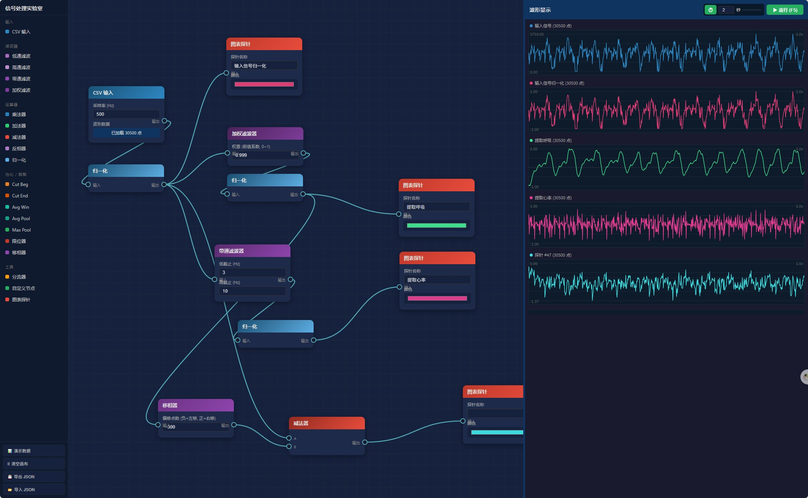

# 信号处理实验室

一个基于浏览器的可视化信号处理工具，通过拖拽节点和连线构建信号处理流程图。

## 功能特性

### 节点类型

| 分类 | 节点 | 说明 |
|------|------|------|
| **输入和输出** | CSV 输入 | 导入 CSV 文件作为信号源，可设置采样率和备注名 |
| | CSV 输出 | 手动导出输入信号为 CSV；也可配合全局自动导出开关定时导出 |
| **滤波器** | 低通滤波 | 一阶 RC 低通滤波器 |
| | 高通滤波 | 一阶 RC 高通滤波器 |
| | 带通滤波 | 低通 + 高通级联 |
| | 加权滤波 | 指数平滑滤波 (EMA)，out = prev·w + input·(1-w) |
| **运算器** | 乘法器 | A × B（双输入，B未连接时用设定值） |
| | 加法器 | A + B（双输入，B未连接时用设定值） |
| | 减法器 | A - B（双输入，B未连接时用设定值） |
| | 反相器 | 信号 × -1 |
| | 绝对值 | out = \|x\| |
| | 归一化 | 映射到 [-1, 1]；支持按全部输入缓冲区或按滑动窗口归一化 |
| | 限位器 | 限制在 [min, max] 范围内 |
| | 移相器 | 信号左右平移 N 个采样点 |
| | 对数乘法器 | out = x·log(1+\|x\|)/log(1+max)，大值乘大系数 |
| | 迟滞比较器 | 双输入(A信号, B阈值)，带迟滞防抖动 |
| | 卡尔曼滤波 | 递归估计器，参数 Q(过程噪声) R(测量噪声) |
| **池化/裁剪** | Cut Beg | 裁掉前 N% 数据 |
| | Cut End | 裁掉后 N% 数据 |
| | Avg Win | 滑动窗口平均（平滑去噪） |
| | Avg Pool | 平均池化降采样（保留趋势） |
| | Max Pool | 最大池化降采样（保留峰值） |
| **工具** | 分流器 | 1 路分为 2 路相同信号 |
| | 开关 | 打开时透传信号，关闭时拦截流程输出空数据，并将下游连线标红 |
| | 多路选择器 | 可设置端口数量；支持多入一出选择一路输入，或一入多出选择一路输出；可用上一个/下一个/随机快速切换；右侧图表只显示选中的输入通道 |
| | 自定义节点 | 编写 JS 代码处理信号 |
| | 便签 | 无输入输出端口的文本备注节点，可随流程图一起保存 |
| | 示波器 | 输出波形到右侧图表（可设颜色）；被关闭开关阻断时不显示 |

### 操作方式

- **添加节点**：从左侧边栏拖拽节点到画布指定位置
- **连线**：从输出端口（右侧圆点）拖拽到输入端口（左侧圆点）
- **删除连线**：点击连线变红后再次点击删除，或右键直接删除
- **删除节点**：选中节点后按 `Delete` 键
- **框选节点**：在画布空白处左键拖拽框选多个节点
- **追加选择**：按住 `Ctrl` 后点击节点标题，可继续添加或移除选中节点
- **移动多选节点**：框选后拖拽任意一个已选节点的标题栏，整组选中节点会一起移动
- **复制粘贴**：`Ctrl+C` / `Ctrl+V`，粘贴的新节点会出现在鼠标所在的画布位置
- **撤销/重做**：`Ctrl+Z` / `Ctrl+Y`
- **平移画布**：鼠标中键拖拽
- **复位视图**：空格键
- **运行**：`F5` 或点击运行按钮
- **CSV 导出**：CSV 输出节点可点击「导出 CSV」单独运行并导出；右上角「自动导出」开关打开后，仅勾选「允许自动导出」的 CSV 输出节点会随运行/定时运行导出
- **归一化范围**：归一化节点可选择「全部」或「窗口」模式；「全部」使用当前输入缓冲区整体计算 min/max，「窗口」按设定点数的滑动窗口计算，窗口大小输入框只在窗口模式下启用
- **图表缩放**：鼠标滚轮
- **图表排序**：拖拽图表标题上下交换顺序

### 其他功能

- 项目自动保存到浏览器本地存储
- 支持导入/导出 JSON 项目文件
- 定时自动运行（可设置间隔）
- 图表光标读数
- 撤销/重做（最多 50 步）

## 使用方法

直接用浏览器打开 `index.html` 即可使用，无需安装任何依赖。

## 快速体验

点击左下角「演示数据」按钮，自动生成含噪声的正弦波测试流程图。

---

